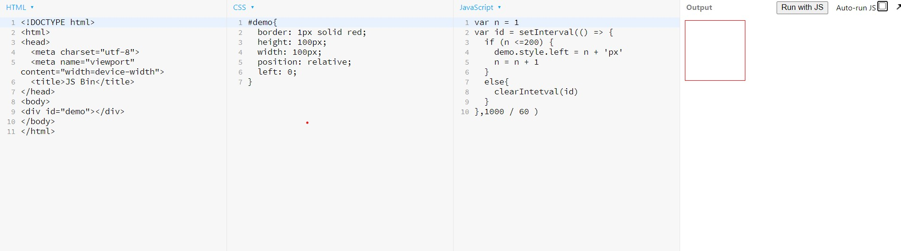
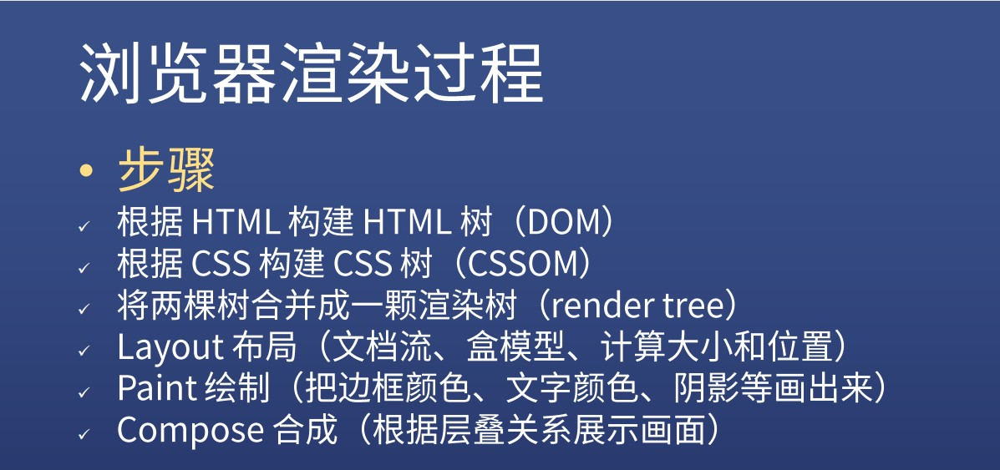
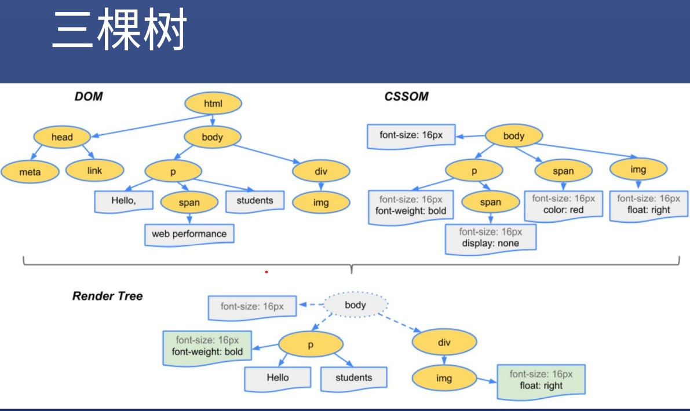
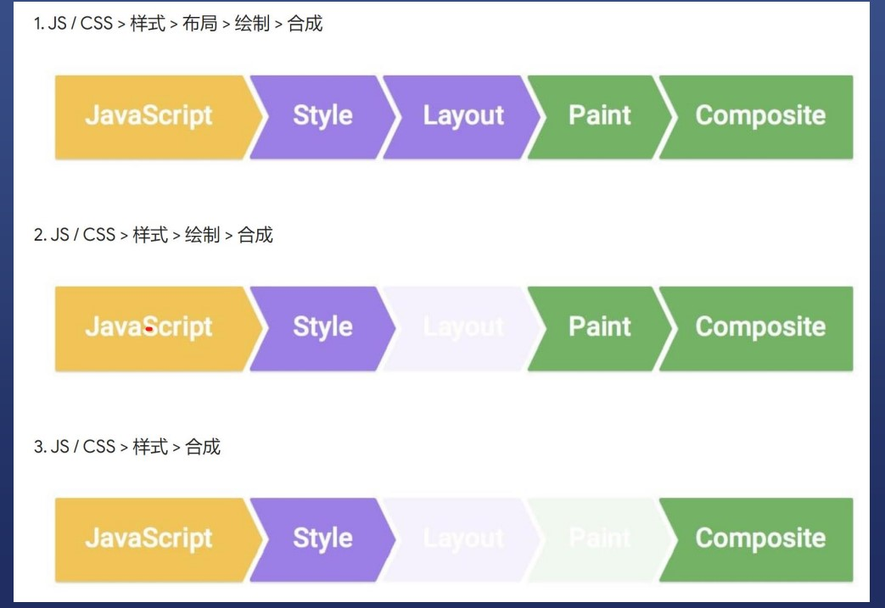

# css动画
* 定义
* 有许多静止的画面(帧)
* 以一定的速度(如每秒三十张)连续播放时
* 肉眼因视觉残像产生错觉
* 而误以为时活动的画面

### 概念
* 帧:每个静止的画面叫做帧
* 播放速度:每秒24帧(电影)和 每秒三十帧(游戏)

### 一个简单的例子
1. 将div从左往右移
* 
2. 原理
* 每过一段时间(用seltnterval做到)
* 将div移动一小段距离
* 直到移到目标地点
3. 注意性能
* 绿色表示重新绘制(repaint)了
* css渲染过程依次包含布局,绘制,合成
* 其中布局和绘制有可能被忽略

### 第二个例子(前端高手不用left做动画)
* 用transform(变形)
* 原理
1. transform:translateX(0 => 300px)
2. 直接修改会被合成,需要等一会修改
3. transition过度属性可以自动脑补中间帧
* 注意性能
1. 并没有repaint(重新绘制)
2. 比改left性能好
### 浏览器渲染过程
* 
* 三棵树
* 

### 如何更新样式
* 三种更新方式
* 
* 如何查看不同属性的渲染流程
* [渲染流程网址](https://csstriggers.com)

### css动画优化
* 详细答案在[网址](https://web.dev/stick-to-compositor-only-properties-and-manage-layer-count/#use-transform-and-opacity-changes-for-animations)
* js优化---使用 request animation frame 代替 set timeout 或 set interval
* css优化-使用will-change或translate
* 需要死记硬背