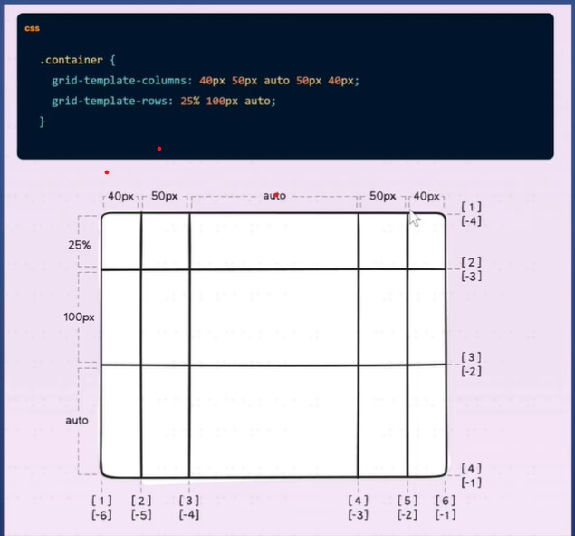
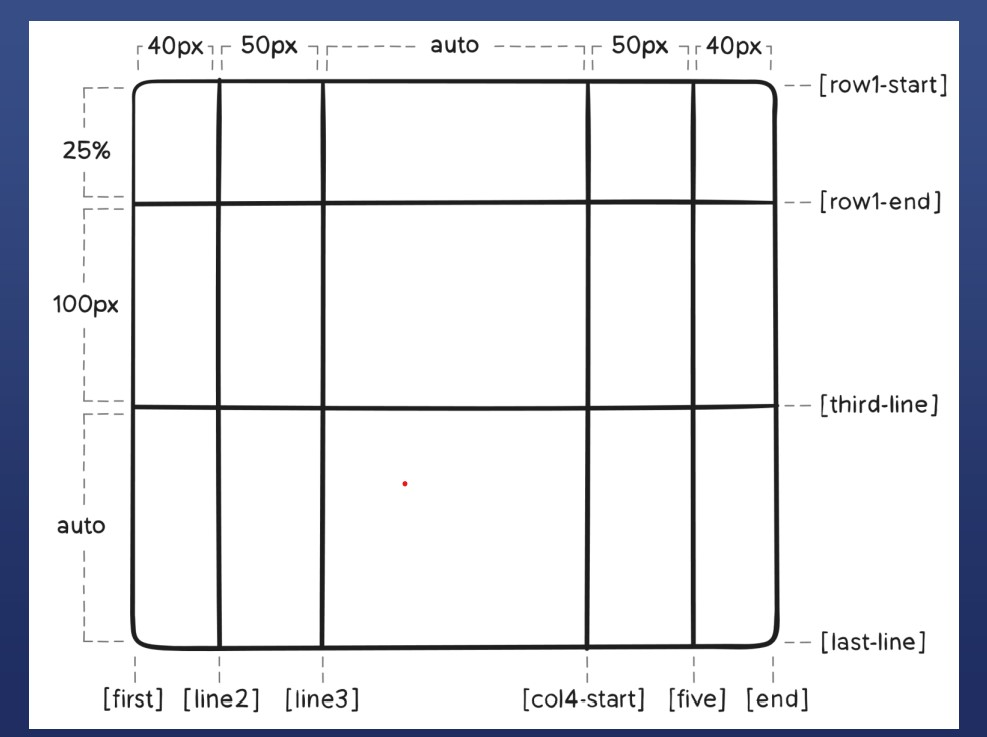
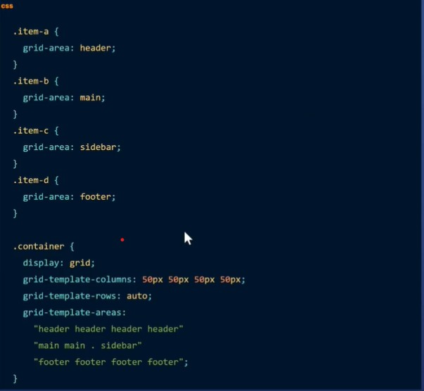
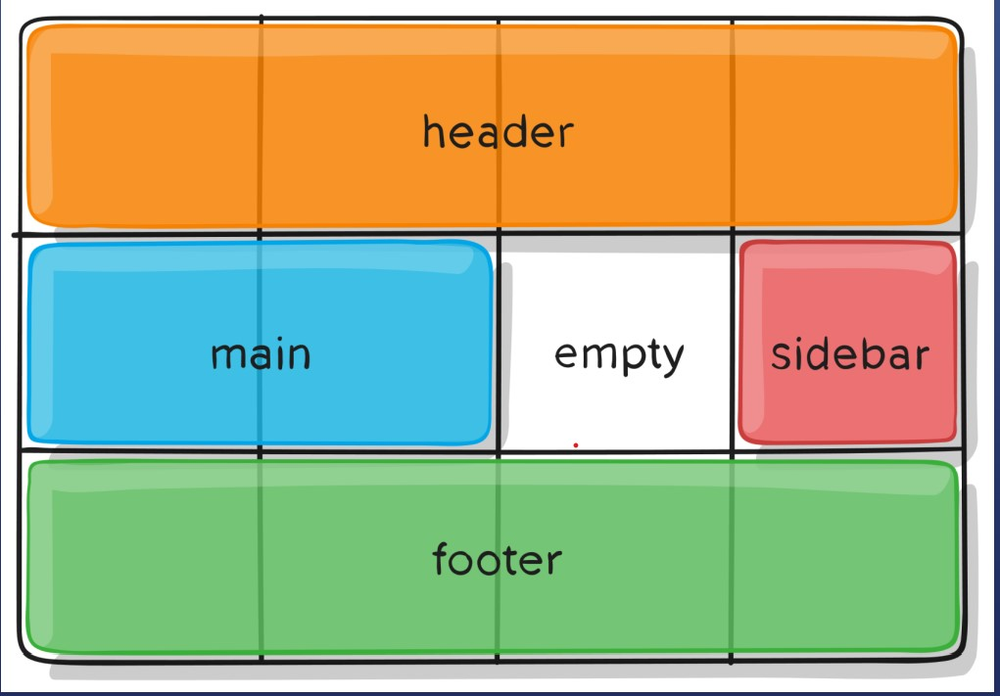
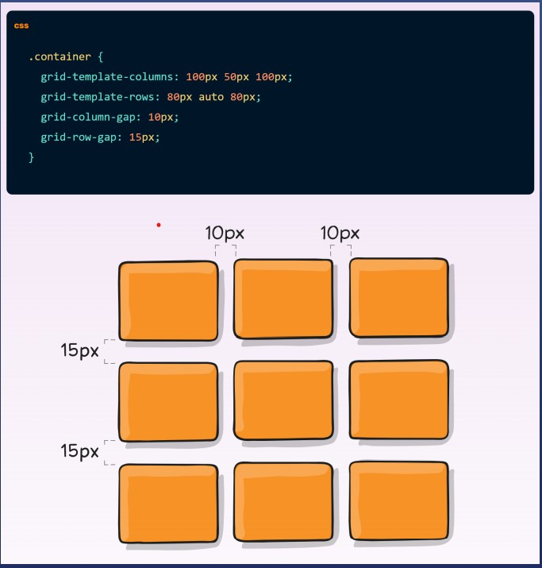

# grid布局
### 成为container
```
.container{
    display: grid  |  inline-grid;
}
```
* 出发条件,在父元素加上


```javascript
.container{
    grid-template-columns: 40px 50px auto 50px 40px;
    grid-template-rows: 25% 100px auto;
}
```
* 可以给每条线取名字
```javascript
.container {
grid-template-columns: [first] 40px [line2] 50px [line3] auto 
[col4-start] 50px [five] 40px [end];
grid-template-rows: [row1-start] 25% [row1-end] 100px [third-line] 
auto [last-line];
}
```
* 取名结果

* 取名有啥用
* item可以取值范围
```javascript
.item-a { 
grid-column-start: 2; (从那一列开始)
grid-column-end: five; (从哪一列结束)
grid-row-start: row1-start;(从哪一行开始)
grid-row-end: 3; (从哪一行结束)
}
### fr(全称free-space)自由空间-巧记:每份
```
grid-template-columns:1fr  1fr 1fr;(分成三份)
grid-template-rows:1fr 1fr ;(分成两份)

### 分区 -grid-template-areas

* 下面是效果图

### 行列之间空隙-gap

### grid适合不规则布局
* 如果每次都输入grid-column-start和grid-column-end两个属性，我们一定会厌烦的。幸运的是，grid-column是一个缩写形式，它可以一次接受两个值，只要用'/'分开就好。

* 比如说：grid-column: 2 / 4;就会设置网格项从第二列开始，到第四列结束。
* 如果你觉得同时输入grid-column和grid-row也很复杂，我们还有另一种缩写。grid-area属性接受4个由'/'分开的值：grid-row-start, grid-column-start, grid-row-end, 最后是grid-column-end。举个例子如下所示：grid-area: 1 / 1 / 3 / 6;。
* 如果网格项不是以grid-area、grid-column、grid-row 等显示的，它们会自动按照它们在源程序中出现的位置摆放。同样我们也可以使用order属性来重写它的顺序，这也是网格布局优于表格布局的好处之一。默认情况下，所有的网格项的order都是0，但是顺序也可以被任意设置为正数或者负数
* 比如说，之前我们使用grid-template-columns: 20% 20% 20% 20% 20%;属性定义了5列，每列占20%。这可以被简写为：grid-template-columns: repeat(5, 20%);
* grid-template是grid-template-rows和grid-template-columns的缩写形式。比如说，grid-template: 50% 50% / 200px;将创建一个具有两行的网格，每一行占据50%，以及一个200像素宽的列。