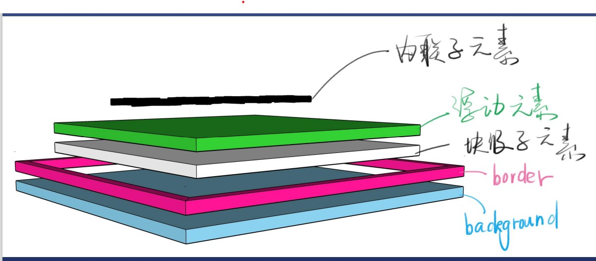

# css定位
* 布局时屏幕平面上的
* 定位是垂直于屏幕的

### 一个div是如何分层的
* 文字内容(内联子元素)>浮动元素>块级子元素>border>background

* 当一个div变成float浮动,脱离文档流,往上一点
* 背景的范围是border外边沿围成的区域

## 新属性position
* static默认值,待在文档流,当前元素带文档流中
* relative相对定位,升起来,但不脱离文档流 
* absolute绝对定位,定位基准是祖先里的非static
* fixed固定定位,定位基准是viewport(有诈)
* sticky粘滞定位-适用于导航
### 经验
1. 如果写了absolute,一般得补个relative
2. 如果写了absolute或fixed 一定要补top和left
3. sticky兼容性很差

### relative
1. 使用场景
* 用于位移(很少用)
*  用于给absolute元素做爸爸
2. 配合z-index
* z-index:auto默认值,不创建新层叠上下文
* z-index:0/1/2
* z-index:-1/-2

3. 经验
* 尽量不要写z-index:9999
  * 学会管理z-index

### absolute
1. 使用场景
* 脱离原来的位置,另起一层,比如对话框的关闭按钮
* 鼠标提示

2. 配合z-index
3. 经验
* 某些浏览器上如果不写top/left会位置错乱
* white-space: nowrap (文字内容不许换行,会经常用到)
* 善用
* absolute相对于祖先元素中最近的一个定位元素

### fixed 使用场景
1. 广告
2. 回到顶部按钮
3. 配合z-index
4. 经验
* 手机上尽量不要用这个属性

## 层叠上下文
* 比喻
* 每个层叠上下文就是一个新的小世界(作用域)
* 这个小世界里面的z-index跟外界无关
* 处在同一个小世界的z-index才能一起比较

* 哪些不正交的属性可以创建它
* 搜索mdn文档
* 需要记忆的有z-index(为0的时候会创建层叠上下文/flex/opacity(不为1创建层叠上下文)/transform
* 忘了就搜索(层叠上下文mdn)

### 文档中的层叠上下文由满足以下任意一个条件的元素形成：

* 文档根元素（<html>）；
* position 值为 absolute（绝对定位）或  relative（相对定位）且 z-index 值不为 auto 的元素；
* position 值为 fixed（固定定位）或 sticky（粘滞定位）的元素（沾滞定位适配所有移动设备上的浏览器，但老的桌面浏览器不支持）；
* flex (flex) 容器的子元素，且 z-index 值不为 auto；
* grid (grid) 容器的子元素，且 z-index 值不为 auto；
* opacity 属性值小于 1 的元素（参见 the specification for opacity）；
* mix-blend-mode 属性值不为 normal 的元素；
* 以下任意属性值不为 none 的元素：
transform
filter
backdrop-filter
perspective
clip-path
mask / mask-image / mask-border
* isolation 属性值为 isolate 的元素；
* will-change 值设定了任一属性而该属性在 non-initial 值时会创建层叠上下文的元素（参考这篇文章）；
* contain 属性值为 layout、paint 或包含它们其中之一的合成值（比如 contain: strict、contain: content）的元素。

### 负z-index:-1不一定能逃出div除非这个div不是一个层叠上下文