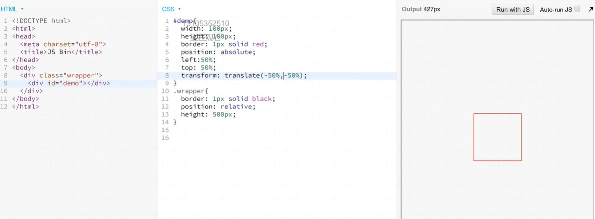
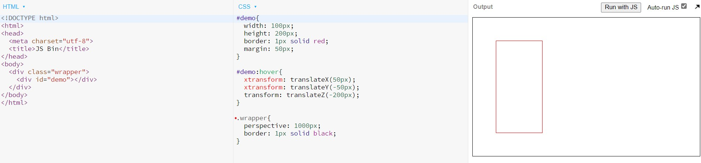
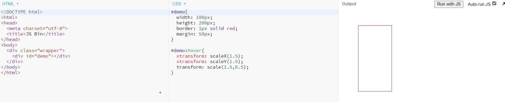
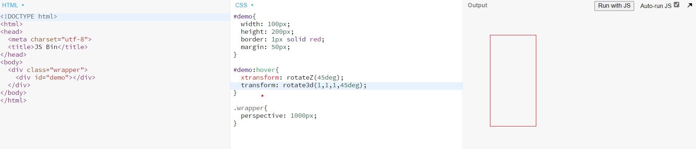
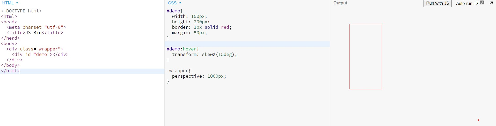

# transform
### 详细内容在-[mdn](https://developer.mozilla.org/zh-CN/docs/Web/CSS/transform)
* 四个常用功能
1. translate 位移 支持xyz
2. scale 缩放
3. rotate 旋转
4. skew 倾斜

* 经验
* 一般都需要配合transition过度
* inline元素不支持transform,需要先变成block

### 居中显示
* 

### translate用法(位移)
* translateX(<length-percentage>)
* translateY(<length-percentage>)
* translate(<length-percentage>,<length-percentage>)
* translateZ(<length>)且父容器perspective
* translate3d(x,y,z)
* 
### 经验
* 要学会看mdn语法示例
* translate(-50%,-50%)可做绝对定位元素居中
### scale用法(缩放)
* 常用写法
1. scaleX(<number>)
2. scaleY(<number>)
3. scale(<number>,<number>?)
4. 
* 注意:用的少,因为容易出现模糊

### rotate常用写法(旋转)
* rotate([<angle> | <zero>])
*  rotateZ([<angle> | <zero>])
*   rotateY([<angle> | <zero>])
*    rotateX([<angle> | <zero>])
*   rotate3d复杂具体看文章[文章地址](https://developer.mozilla.org/zh-CN/docs/Web/CSS/transform-function/rotate3d)
* 
* 经验-一般用于制作360°旋转制作loading
* 用到时搜索rotate mdn文档

### skew(倾斜)常用写法
* skewX([<angle>] | [<zero>])
* skewY([<angle>] | [<zero>])
* skew([<angle>] | [<zero>],[<angle>] | [<zero>])
* 
* 经验-用的少,用到时搜索skew mdn

### transform多重效果
1. transform:scale(0.5) translate(-100%,-100%);
2. transform:none;取消所有
